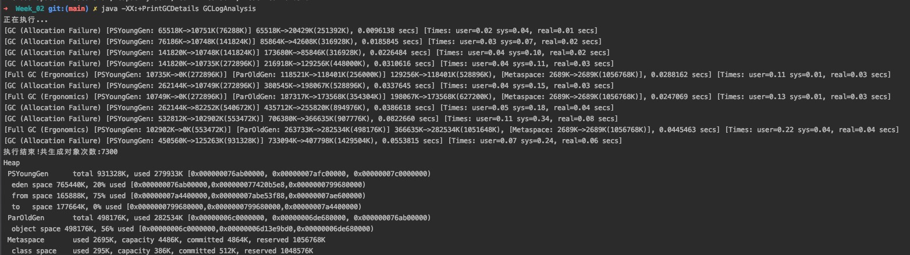

# 周四作业
[第1题](work1.md)

[第4题](work4.md)
# 周六作业
[第一题](work01.md)

[第二题](Work2.java)
# 学习笔记
### JVM核心技术（三）：调优分析与面试经验
1.直接运行 java -XX:+PrintGCDetails GCLogAnalysis
-XX:+PrintGCDetails ： 打印GC的详细信息
由于使用的是jdk8版本，默认使用的是并行GC



日志解析：
 * [GC 和 [Full GC  代表GC的停顿类型
 * Allocation Failure 说明分配空间失败导致
 * Ergonomics 这种一般出现在关注吞吐量的收集器中，在某个generation被过度使用之前，GC ergonomics就会启动一次GC
 * [PSYoungGen 、[ParOldGen 、[Metaspace 代表GC发生的区域。这些区域名称与使用的GC收集器相关
 * DefNew代表Serial收集器，ParNew代表Parallel New Generation，PSYoungGen代表用的是Parallel Scavenge，ParOldGen使用的是Parallel Old，Tenured使用的是Serial Old
 * 方框中的65518K->10751K(76288K) 含义是GC前该内存区域已使用容量->GC后该内存区域已使用容量(该内存区域总容量)
 * 方括号之外 65518K->20429K(251392K) 表示GC前Java堆的已使用容量->GC后Java堆的已使用容量(Java堆总容量)
 * [Times: user=0.02 sys=0.04, real=0.01 secs] GC事件的持续时间，按不同类别进行度量，
 * user 在此收集期间，垃圾收集器线程所消耗的总CPU时间 ，sys 花费在操作系统调用或等待系统事件上的时间， real 应用程序被停止的时钟时间。对于并行GC，这个数字应该接近于(用户时间+系统时间)除以垃圾收集器使用的线程数。注意，由于某些活动不能并行，它总是会超过一定数量的比率。

分析第一行收集日志
 * [GC (Allocation Failure) 代表新生代内存分配失败
 * [PSYoungGen: 65518K->10751K(76288K)] 发生了一次youngGC，内存空间从 65518K清理到 10751K，当前新生代总容量是76288K
 * 65518K->20429K(251392K) java堆的清理情况，这里有一个细节可以注意到，刚开始 新生代和java堆的已使用容量是相同的，说明刚开始我们的老年代是没有内存占用的
 * 同时还注意到，新生代清理完之后内存使用量是10727K，但是java堆清理完之后使用量是24418K，这说明我们有13691K进入了老年代，这个可以从第二行也验证这一点
 * 第二行的 [PSYoungGen: 75913K->10751K(141824K)] 89603K->50960K(316928K) 年轻代使用内存是 75913K，而Java堆使用内存是89603K，89603 - 75913 = 13691，正好是当前老年代使用的内存容量
 *  [Times: user=0.01 sys=0.05, real=0.01 secs] 由于我当前使用的系统核心线程数是4，用的并行收集器，并行收集器默认线程数分配是，如果大于8个则取5/8,如果小于8个，则直接使用核心线程数。而时间real = (user + sys) / 4 大概约等于0.01

 
 ### 内存布局分析
 本机64位，本地测试一个空的类，代码如下：
 ```java
public class MemoryTest {
    public static void main(String[] args) {
        MemoryTest memoryTest = new MemoryTest();
        //查看对象内部信息
        System.out.println(ClassLayout.parseInstance(memoryTest).toPrintable());
        //查看对象外部信息
        System.out.println(GraphLayout.parseInstance(memoryTest).toPrintable());
        //获取对象总大小
        System.out.println("size: " + GraphLayout.parseInstance(memoryTest).totalSize());
    }
}
```
通过JOL查看空对象的内存布局，发现：
```text
com.wyc.jvm.MemoryTest object internals:
 OFFSET  SIZE   TYPE DESCRIPTION                               VALUE
      0     4        (object header)                           01 00 00 00 (00000001 00000000 00000000 00000000) (1)
      4     4        (object header)                           00 00 00 00 (00000000 00000000 00000000 00000000) (0)
      8     4        (object header)                           05 c0 00 f8 (00000101 11000000 00000000 11111000) (-134168571)
     12     4        (loss due to the next object alignment)
Instance size: 16 bytes
Space losses: 0 bytes internal + 4 bytes external = 4 bytes total

com.wyc.jvm.MemoryTest@7cef4e59d object externals:
          ADDRESS       SIZE TYPE                   PATH                           VALUE
        76abb8848         16 com.wyc.jvm.MemoryTest                                (object)
size: 16
```
但是通过老师的图，感觉正常应该是对象头，标记位占一个机器字，Class指针占一个机器字，那这样的话，应该不会有4bytes是用来补齐的，现在从结果看，不符合预期
后来查看了部分资料发现，从JDK 1.6 update14开始，64位的JVM正式支持了 -XX:+UseCompressedOops 这个可以压缩指针，起到节约内存占用的新参数
也就是说，默认我这个是开启了压缩指针，我在启动VM参数加上了 -XX:-UseCompressedOops之后
```text
com.wyc.jvm.MemoryTest object internals:
 OFFSET  SIZE   TYPE DESCRIPTION                               VALUE
      0     4        (object header)                           01 00 00 00 (00000001 00000000 00000000 00000000) (1)
      4     4        (object header)                           00 00 00 00 (00000000 00000000 00000000 00000000) (0)
      8     4        (object header)                           c0 a4 6b 17 (11000000 10100100 01101011 00010111) (392930496)
     12     4        (object header)                           01 00 00 00 (00000001 00000000 00000000 00000000) (1)
Instance size: 16 bytes
Space losses: 0 bytes internal + 0 bytes external = 0 bytes total

com.wyc.jvm.MemoryTest@424c0bc4d object externals:
          ADDRESS       SIZE TYPE                   PATH                           VALUE
        1d2fde1b8         16 com.wyc.jvm.MemoryTest                                (object)
size: 16
```
发现结果是符合预期的。这里要注意一下