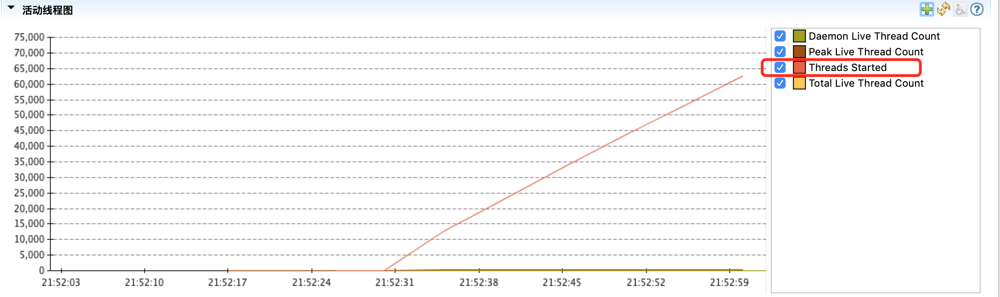
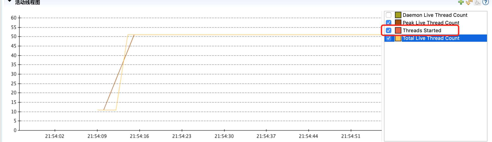
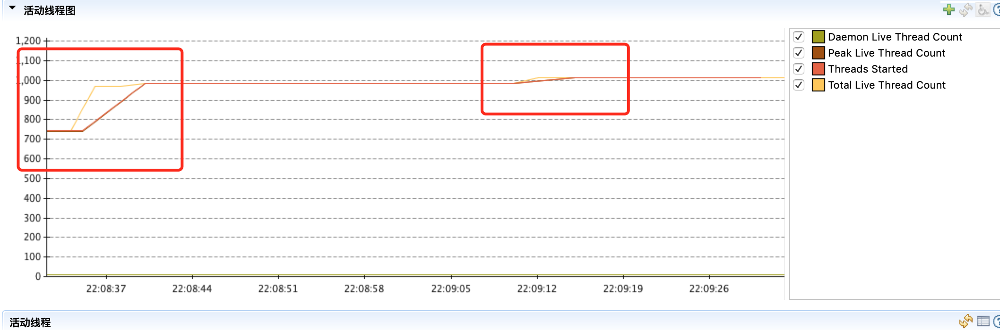

### 题目：1.（选做）运行课上的例子，以及 Netty 的例子，分析相关现象。
* 通过老师的代码，分别运行了HttpServer01、02、03 由于本机其他原因，无法完全看到明显区别，但是线程数的区别很明显
* 01的QPS确实是比02和03小很多， 02，03 差距不大
* 但是通过jmc看线程数记录发现明显区别

wrk参数：wrk -t80 -c240 -d30s --latency http://localhost:8802

上图为2实验的线程数图，图中Threads Started代表开始过的线程数量在30s内达到近65000个线程数

而上图为 图3的线程数图，图中虽然没有看到红线，原因是和Total Live Thread Count重合在一起了。
从图中可以看出，由于使用了40个线程的线程池，线程数只增长了40个

* 从而说明线程池明显降低了线程的数量，有巨大的优化

使用老师netty例子，结果QPS有巨大的提升
通过jmc发现个有意思的是，当我们有新的连接建立的时候，如果当前netty服务的workerGroup线程池没有达到上限，则对于新的连接会创建新的线程池来处理，直到线程池达到设置为止，不再创建线程

